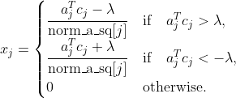

# 解决Lasso问题的优化算法对比实验

## 一、实验目的

本实验实现了多种求解Lasso问题的优化算法，并通过对比实验分析不同算法的收敛性能。Lasso问题的目标函数为：

$$
f(x) = \frac{1}{2} \|Ax - b\|_2^2 + \lambda \|x\|_1
$$

第一项为loss项，第二项为L1正则化项。 

## 二、数据生成过程

数据生成由`create_lasso_problem`函数实现，具体流程如下：

1. **生成矩阵A**：
   - 随机生成形状为`(n_samples, n_features)`的矩阵，元素服从标准正态分布 $N(0,1)$ 
   - 按列归一化处理：计算每列的L2范数，将每列除以其范数（若范数为0则替换为1，避免除零错误），确保各特征列的尺度一致
2. **生成真实解x_true**：
   - 初始化为全零向量
   - 随机选择`sparsity * n_features`个索引作为非零元素位置（体现稀疏程度）
   - 非零元素服从正态分布 $N(0,1)$ ，缩放系数为1.0
3. **生成观测向量b**：
   - 基础值为`A @ x_true`，这是无噪声的理想观测
   - 加入噪声：添加服从 $N(0, 0.01^2)$ 的随机噪声，模拟真实观测中的误差

## 三、参数选择说明

### 核心参数设置

| 参数名          | 取值               | 说明                       |
| ------------ | ---------------- | ------------------------ |
| `n_trials`   | 10/50            | 实验重复次数，计算平均收敛曲线，减少随机误差影响 |
| `n_samples`  | 200/250/500/1000 | 样本数量                     |
| `n_features` | 500/250/200      | 特征数量，将其设置为高于样本数量可以模拟高维特性 |
| `sparsity`   | 0.1              | 真实解的稀疏度（非零元素占比）          |
| `lambda_val` | 0.1              | 正则化系数，控制稀疏性强度            |
| `max_iter`   | 300              | 最大迭代次数                   |
| `device`     | 优先`cuda`，否则`cpu` | 计算设备，优先使用GPU加速           |

### 算法特定参数

- **光滑梯度下降（Smoothed GD）**：
  
  `epsilon`：光滑化参数，取值1e-4、1e-6、1e-8，控制L1正则化的近似光滑程度。值越小近似越精确，但梯度可能越不稳定。

- **ADMM（交替方向乘子法）**：
  
  `rho`：惩罚参数，取值0.3、0.5、1.0、1.5、2.0，平衡约束满足程度与目标函数优化

- **梯度类算法（GD/Proximal GD/FISTA）**：
  
  学习率`lr`：默认取`1/L`（`L`为Lipschitz常数，由`A`的谱范数平方计算），保证收敛性的自适应学习率。但对于次梯度下降和光滑化梯度下降，为了防止曲线收敛到一个大精度就停止，实验中我们酌情减小学习率。

## 四、算法流程

### 1. 普通梯度下降（Ordinary GD）

- **原理**：基于次梯度下降，因L1正则化在0点不可导

- **步骤**：
  
  1. 计算loss项的梯度： $A^T (Ax - b)$ 
  
  2. 计算正则项次梯度：在次梯度集合中取0
  
  3. 总次梯度为两者之和。应用梯度裁剪：范数超过1e3时进行缩放防止梯度爆炸，以致算法不收敛
  
  4. 更新规则： $x = x - lr * 次梯度$

### 2. 近端梯度下降（Proximal GD）

- **原理**：通过近端算子处理非光滑项

- **步骤**：
  
  1. 计算光滑项梯度： $A^T (Ax - b)$，应用梯度裁剪
  
  2. 梯度下降步： $x_{temp} = x - lr * 梯度$
  
  3. 近端操作：对`x_temp`应用L1正则的软阈值算子`soft_threshold(x_temp, lr*λ)`计算

- 软阈值公式： $prox(x) = sign(x) * max(|x| - threshold, 0)$

### 3. 光滑梯度下降（Smoothed GD）

- **原理**：用光滑函数近似L1正则化，将非光滑问题转化为光滑问题

- **步骤**：
  
  1. 计算数据拟合项梯度： $A^T (Ax - b)$
  
  2. 计算光滑L1正则的梯度： $λx / \sqrt{(x² + ε)}$（ $ε$ 为光滑参数）
  
  3. 总梯度为两者之和，应用梯度裁剪
  
  4. 更新规则： $x = x - lr * 梯度$，并截断在`[-1e3, 1e3]`

### 4. ADMM（交替方向乘子法）

- **原理**：通过引入辅助变量将问题分解为可高效求解的子问题，利用对偶上升法优化

- **步骤**：
  
  1. **变量拆分**：引入辅助变量`z`，使目标等价于 $min \frac{1}{2}‖Ax - b‖² + λ‖z‖₁$ ,   $s.t. \quad  x = z$
  
  2. **x更新**：求解二次规划子问题，利用Cholesky分解高效计算 $x = (A^TA + ρI)^{-1} (A^Tb + ρ(z - u))$
  
  3. **z更新**：对`x + u`应用软阈值算子计算`z = soft_threshold(x + u, λ/ρ)`
  
  4. **对偶变量更新**： $u = u + x - z$

### 5. 坐标下降（Coordinate Descent）

- **原理**：每次更新一个变量（特征），固定其他变量，将高维问题降为一维子问题

- **步骤**：
  
  1. 预计算 $A^TA$,  $A^Tb$ 和各特征列的L2范数平方`norm_a_sq`
  
  2. 每次迭代随机打乱特征顺序，按顺序更新每个变量 $x_j$：

- 计算梯度分量： $c_j = a_j^T (b - A_{-j}x_{-j})$（排除第j个特征的贡献）

- 软阈值更新:
  

### 6. FISTA（加速的近端梯度下降）

- **原理**：在近端梯度基础上引入动量加速，提高收敛速度

- **步骤**：
  
  1. 初始化动量参数`t = 1`，变量`x_prev = x`
  
  2. 计算加速点： $y = x + \frac{t-1}{t} (x - x_{prev})$
  
  3. 计算光滑项梯度并更新临时变量： $x_{temp} = y - lr * 梯度$
  
  4. 近端操作：`x_new = soft_threshold(x_temp, lr*λ)`
  
  5. 更新动量参数： $t_{new} = \frac{1 + \sqrt{1 + 4t²}}{2}$，`t = t_new`，`x_prev = x`，`x = x_new`

### 7. FISTA+Restart（带重启的加速近端梯度）

- **原理**：在FISTA基础上增加重启机制，当加速条件不满足时重置动量，避免收敛停滞

- **步骤**：与FISTA基本一致，增加重启条件：若 $\langle \nabla f(y),  x_{\text{new}} - x \rangle \geq 0$（加速方向无效），则重置`t = 1`并将加速点`y`重置为`x`

### 8. 基准方法：sklearn Lasso

- **原理**：调用scikit-learn的Lasso求解器作为最优解的基准

- **数量级适配处理**：因sklearn目标函数为 $\frac{1}{2n_{samples}}‖Ax - b‖² + α‖x‖₁$，将`α`设置为`λ / n_samples`以保持目标函数一致

## 五、实验结果展示

通过多次重复试验，绘制各算法的平均收敛曲线,  $f(x_k) - f^{\*}$ 的对数坐标， $f^{\*}$ 为基准方法的最优值，对比不同算法的收敛速度和稳定性。结果图中单次试验曲线是细浅色，平均曲线是粗深色。

我们分别对比了低维情况、高维情况和平衡情况：

本文的SVG链接/图片生成网站: https://editor.codecogs.com/
